# Part 3: Managing and measuring models for trust and transparency with Eric Martens

Welcome! The instructions below have been provided as part of an IBM Developer webcast series. By following along, you will provision IBM Cloud services, train and deploy a machine learning model, and configure fairness, accuracy and drift monitoring for that model.

## Prerequisites
In this step, you will provision and install the services and software you need for the hands-on lab. If you have done previous lessons in this series, you will likely have already completed one (or all) of these.

1. Sign up for a free [IBM Cloud account](https://cloud.ibm.com/).
2. Sign up for a free [Watson Studio account](https://dataplatform.ibm.com/).
3. Provision a free lite instance of [Watson Machine Learning](https://cloud.ibm.com/catalog/services/machine-learning). **Choose either the Dallas or Frankfurt region.**
4. Provision a free lite instance of [Watson OpenScale](https://cloud.ibm.com/catalog/services/watson-openscale). **Choose the same region (Dallas or Frankfurt) you selected for Watson Machine Learning.** You just need to provision the service for now.
5. Provision a free instance of [Object Storage](https://cloud.ibm.com/catalog/services/cloud-object-storage).

## 0. Environment setup
In this step, you will create the service credentials and projects you need for the hands-on lab.

Start by creating credentials for Watson Machine Learning. Navigate to your [IBM Cloud Resources page](https://cloud.ibm.com/resources). From the **Resource list**, expand the **Services** section and click on the instance of Watson Machine Learning you created in the previous section.

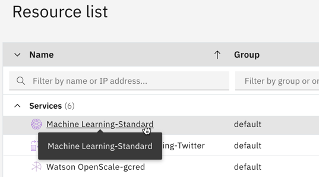

From the menu on the left, click on **Service credentials**.

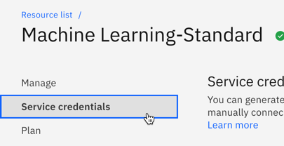

Click blue the **New credential** button.

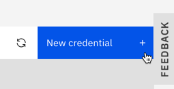

Give your credentials a name, and then click the **Add** button.

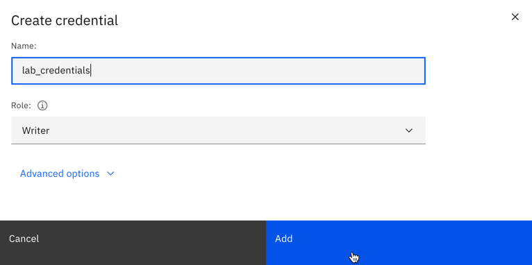

Your new credentials will appear in the list. Click the **copy button** to copy them to your clipboard.

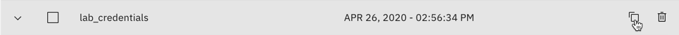

Open your favorite text editor and paste the credentials into a new file. We will use them in a few different locations in later steps.

Next, you'll need a Cloud API key. Navigate to the [Cloud user API key page](https://cloud.ibm.com/iam/apikeys) and click the **Create an IBM Cloud API key** button.

Give your key a name and click the **Create** button.

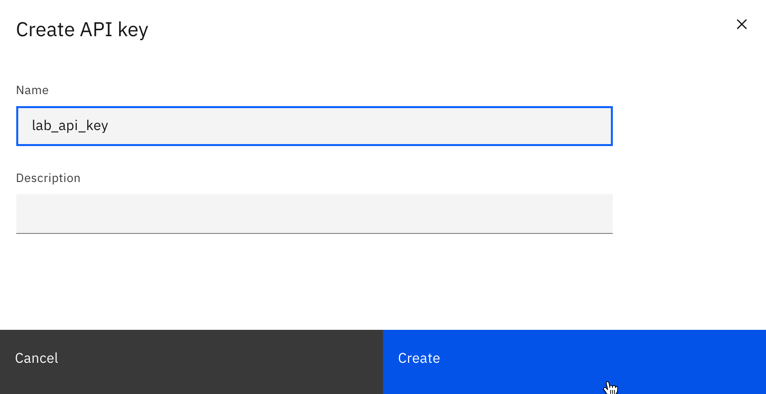

Click the **Copy** button to copy the key to your clipboard.

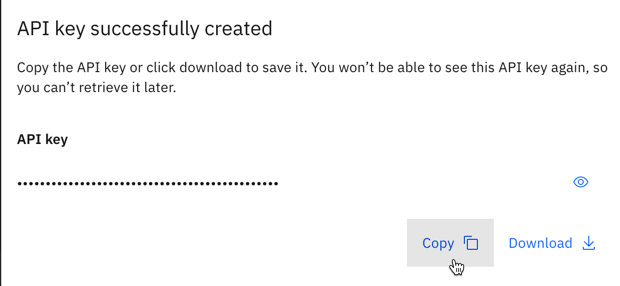

Paste the API key into your text editor file for later use.

Finally, you will need to create a Watson Studio project for your Python notebooks and models. Navigate to the [Watson Studio home page](https://dataplatform.cloud.ibm.com/) and click the **New project** button.

Click the **Create an empty project** tile.

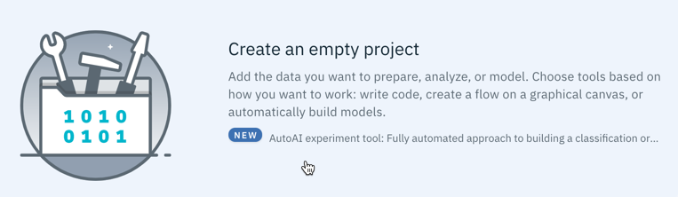

Give your project a name. In the **Define storage** section, select the Object Storage instance you created in the previous section, and then click **Create**.

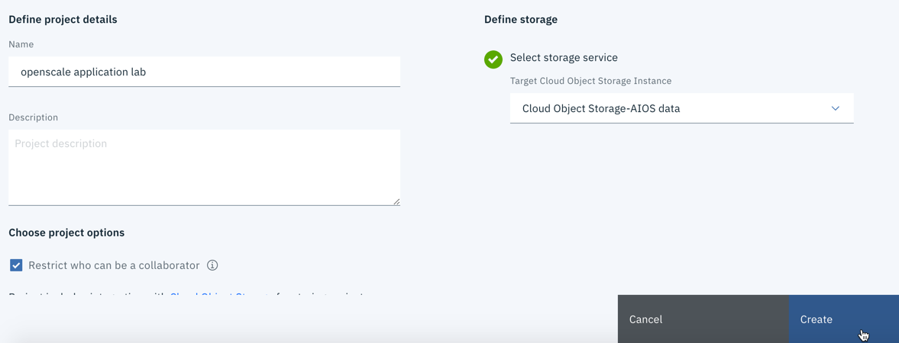

Click on the **Settings** tab at the top of the screen.

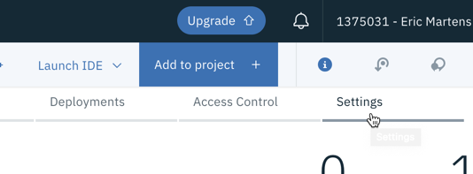

Scroll down to the **Associated services** section. Click the **Add service** button and select **Watson** from the list.

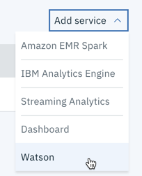

Click the **Add** button on the **Machine Learning** tile.

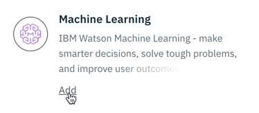

Select the instance of Watson Machine Learning you created in a previous step from the dropdown, and click the **Select** button.

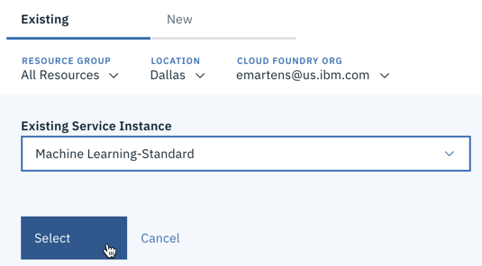

You are now ready to begin the lab.

## 1. Create and deploy the machine learning model

Navigate to [this repo](https://github.com/lidderupk/ai-developer) and clone or download the files to your machine. Extract the downloaded files on your machine.

Navigate to your [list of projects in Watson Studio](https://dataplatform.cloud.ibm.com/projects?context=wdp), and click on the project you created in the previous section to open it.

Click on the **Assets** tab.

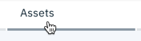

In the upper section of the screen, click the **Add to project** button.

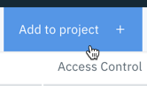

Select **Notebook**.

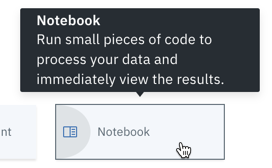

Select the **From file** tab, and then click on the **Drag and drop files here or upload** link at the bottom.

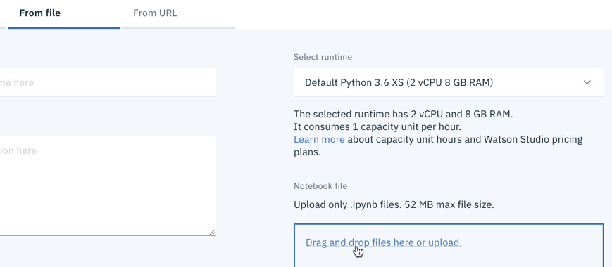

Navigate to the folder where you extracted the github files, open the **notebooks** folder, select **mortgage\_default_training.ipynb**, and then click **Open**.

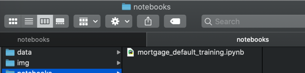

Click the **Create** button to create the notebook in your Watson Studio project. When the notebook has loaded, scroll down to the first two code cells. You will want to replace the values for **WML_CREDENTIALS** and **CLOUD\_API_KEY** in these two cells with the credentials and API key you created in a previous step. Ensure that the Watson Machine Learning credentials are enclosed in the curly braces, and that the Cloud API key is enclosed in quotation marks.

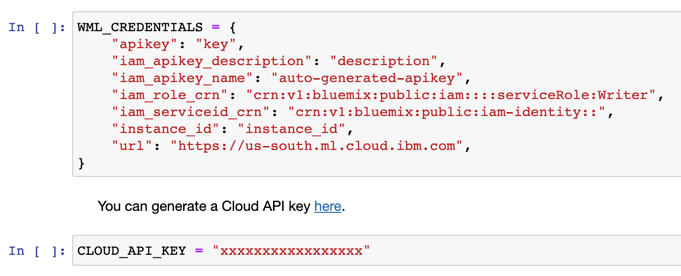

You can now run the cells in the notebook. Click on the **Cell** menu and select **Run All**. You may also choose to run the cells one at a time.

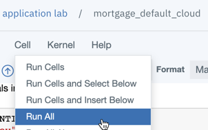

The notebook will pull the training data from GitHub and use it to train a random forest classification model. It will then deploy that model as a web service to your Watson Machine Learning instance, and configure OpenScale to monitor the model.

The notebook is heavily commented to help you understand what each cell is doing. You may read through it for more detailed information.

If the notebook successfully completes, you may proceed to the next step.

## 2. Configure Watson OpenScale monitors

Watson OpenScale monitors production machine learning models for quality, fairness, and drift. It also provides detailed explanations of model predictions.

Navigate to [Watson OpenScale](https://aiopenscale.cloud.ibm.com/aiopenscale/). Once you have signed in, you will see the Insights Dashboard, which provides an overview of the models you are monitoring. 

The notebook you ran in the previous step set up our model for monitoring. We will now configure the individual monitors. Click on the tab for the mortgage model.

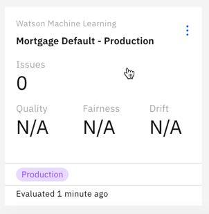

From the action menu, click on **Configure monitors**.

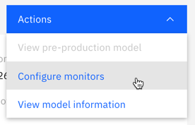

The first monitor we'll configure is the **Fairness** monitor. It ensures that our model is not unfairly biased against a particular group. For this use case, we wanted to make sure that our model was treating online applications fairly. Click the **Fairness** monitor section.

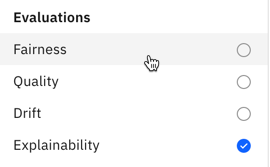

Click the **Edit** icon in the **Favorable outcomes** tile.

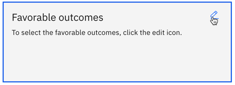

Use the checkboxes to set the **Favorable** value to "NO" and the **Unfavorable** value to "YES." Click **Next**.

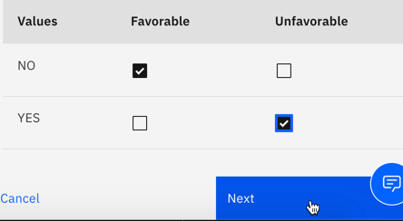

Set the **Minimum sample size** to 200, then click **Next**.

Use the checkbox to set the **Fields to monitor** to "AppliedOnline" and click **Next**.

Use the checkboxes to set the **Reference** group to "NO" and the **Monitored** group to "YES." This will tell OpenScale to watch for unfair bias against people who have used our online application form, and alert us if the fairness score drops below 80%. Click **Save**.

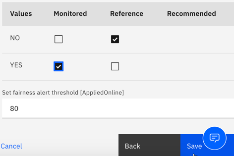

Next, we'll configure the quality monitor. Select it from the list on the left.

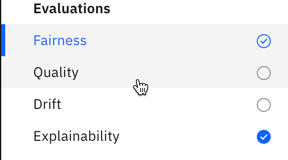

Click the **Edit** icon in the **Quality threshold** tile.

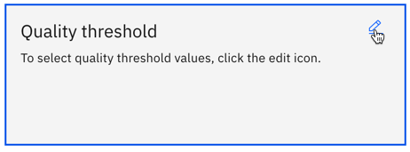

The default threshold is for Area under ROC, and is set to 0.8. Click **Next**.

Set the minumum sample size to 100, and then click **Save**.

Finally, we'll configure the drift monitor. This will measure any predicted drops in accuracy or data consistency as your model makes predictions. Click the **Drift** monitor from the list on the left.

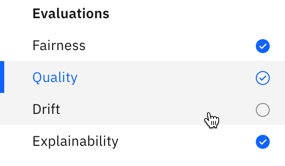

Click the **Edit** icon on the **Drift model** tile.

Use the radio buttons to set the **Training option** to "Train in Watson OpenScale" and the click **Next**.

Set the **Drift threshold** to 5% and click **Next**.

Set the **Sample size** to 100 and click **Save**. OpenScale will now use the model training data to train and deploy a drift model. The drift model compares data submitted to your model with the training data, and tries to predict if the submission data shares characteristics with data your model struggles to correctly predict. In this way, OpenScale can identify costly drops in model accuracy without requiring additional feedback data.

Congratulations! You have finished configuring OpenScale monitoring for your model.

## 3. Feed data into the model

Now that the monitors are configured, let's give them some data to monitor. Navigate to your [list of projects in Watson Studio](https://dataplatform.cloud.ibm.com/projects?context=wdp), and click on the project you are using.

From the **Assets** tab, click **Add to project** and select **Notebook**.

Select the **From file** tab, and drag and drop or upload the **mortgage_default_feed.ipynb** notebook from the repo files you downloaded earlier. Click **Create**.

As you did with the previous notebook, replace the WML credentials and Cloud API key in the first two code cells with the correct values. You can use the third code cell to alter the number of predictions and feedback records submitted to the model, though if you lower any of these numbers, you may need to run the notebook more than once to exceed the minumum thresholds required for the monitors that we set up in the previous step.

Run all cells in the notebook. If you wish, you can use the instructions at the bottom of the notebook to schedule it to run regulary and simulate a continued influx of data into your model. Before setting this up, take into account the limits of the free plans for Watson Machine Learning and Watson OpenScale.

You may now return to [Watson OpenScale](https://aiopenscale.cloud.ibm.com/aiopenscale/) and see how your model is performing. Note that the fairness and accuracy monitors run hourly, and the drift monitor runs every three hours. You can initiate the runs manually via the OpenScale UI, or wait for them to run automatically.

## 4. Next steps

For more information on Watson OpenScale, visit the [IBM Demos page](https://www.ibm.com/demos/collection/IBM-Watson-OpenScale/). 
